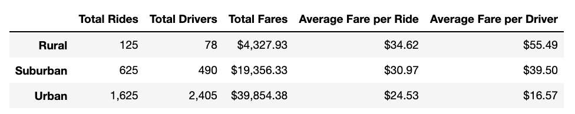

# PyBer_Analysis

## Overview / Purpose:
   * The purpose of this project was to give V. Isualize a written analysis of Pyber ride-sharing data and demonstrate how ride-sharing data differs by city type. In order to accomplish this, Python, Pandas, and Matplotlib were used to create a summary DataFrame and multiple-line graph that shows the total weekly fares for each city type. 

## Results:
  * As depicted in the chart below, There is a description of the differences in ride-sharing data among the different city types. Ride-sharing data include the total rides, total drivers, total fares, average fare per ride and driver, and total fare by city type. 

[PyBer_Challenge_Code](PyBer_Challenge.ipynb)
